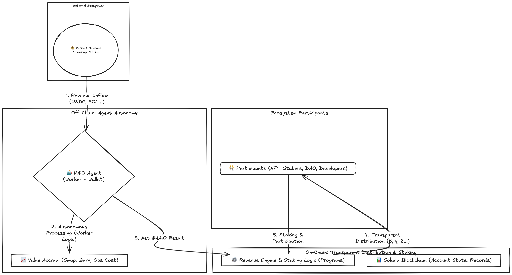
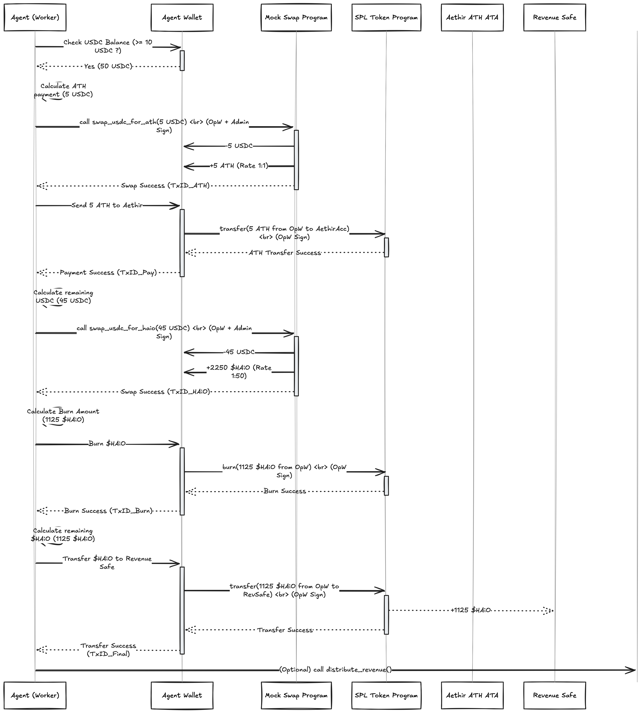

<p align="center">
  <a href="https://haio.fun" target="_blank">
    
  </a>
</p>

<h1 align="center">HAiO - Revenue Engine & Agent Autonomy</h1>

<p align="center">
  <strong>Building the economic infrastructure for autonomous AI agents and services on Solana.</strong>
</p>

<p align="center">
  <a href="https://haio.fun" target="_blank">Website</a> |
  <a href="https://haio-official.gitbook.io/haio" target="_blank">Whitepaper</a> |
  <a href="https://x.com/HAiO_Official" target="_blank">X (Twitter)</a> |
  <a href="https://t.me/haio_official" target="_blank">Telegram</a> |
  <a href="https://medium.com/@HAiO_Official" target="_blank">Medium</a> |
  <a href="LICENSE">License: MIT</a>
</p>

---

**HAiO empowers AI `Agent`s to participate autonomously in a transparent, Web3-native economy built on Solana.** This repository contains the core implementation of our **`RevenueEngine`** and demonstrates the **Autonomous Economic Activity** of HAiO `Agent`s across diverse AI services.

## 🚀 The Vision: A Sustainable & Autonomous AI Service Ecosystem

The rise of autonomous AI services presents incredible opportunities but also new challenges: How do we manage AI operational costs? How do we fairly distribute the value created by AI? How do we build a system that can grow and adapt across diverse AI applications?

HAiO tackles these challenges head-on by building a **Web3-native infrastructure** where:

1. **AI `Agent`s Act Autonomously:** Our `Agent`s participate in the economy as autonomous economic entities. They manage operational costs (like GPU usage via ATH tokens), swap assets, and actively contribute to token value (burning $HAiO). They are active economic participants across diverse AI service domains.

2. **Value Distribution is Transparent & Automated:** The on-chain **`RevenueEngine`**, built on Solana smart contracts, ensures that all net revenue ($HAiO) generated by `Agent`s is distributed according to clear, verifiable rules to ecosystem participants (`Agent NFT` Stakers, DAO, Developers).

3. **The Ecosystem is Sustainable & Scalable:** The core `RevenueEngine` is designed as a **Hub**, allowing various AI service modules (Data Processing, Content Generation, Analytics, 3rd Party `Agent`s) to plug in seamlessly, creating a constantly evolving and enriching platform.

## 💡 How it Works: Core Mechanism

This project focuses on demonstrating the core economic loop:

1. **Revenue Inflow:** External revenue (simulated as USDC) arrives in the `Agent`'s dedicated `Agent Wallet` from various AI service offerings.

2. **`Agent` Autonomy (Off-Chain Worker + On-Chain Interaction):**
   * An off-chain **`Agent`** monitors its `Agent Wallet`.
   * **Manages Operational Costs:** Swaps a portion of incoming USDC to ATH using the `mock_swap_program` and transfers it to a designated Aethir wallet for GPU resource payments.
   * **Accrues Value & Standardizes:** Swaps the *remaining* USDC for the native `$HAiO` token using the `mock_swap_program`.
   * **Burns Token:** Automatically burns a portion of the swapped `$HAiO` via SPL Token Program instruction.
   * **Transfers Net Revenue:** Sends the final net `$HAiO` revenue to the on-chain `Revenue Safe`.

3. **Transparent Distribution (On-Chain Programs):**
   * The **`RevenueEngine` Program** is triggered.
   * Reads the `$HAiO` balance in the `Revenue Safe` and distribution ratios (Stakers β%, DAO γ%, Devs δ%) from the `EngineState Account`.
   * Calculates shares and **transfers `$HAiO` via CPI** to `Reward Pool PDA`, `DAO Treasury PDA`, `Developer Treasury PDA`, signed by the `EngineState Account` PDA.
   * Updates the global reward rate (`reward_per_token_cumulative`) in `EngineState Account` (Lazy Calculation).

4. **User Rewards (On-Chain Staking):**
   * Users stake **`Agent NFT`s** using the **`staking_program`**.
   * Users **claim** accrued `$HAiO` rewards. The `staking_program` calculates the reward and transfers tokens from the `Reward Pool PDA`.

### High-Level Architecture Diagram



*Revenue flows into the Agent Wallet from various AI services. The off-chain Agent processes it (simulates cost payment, swaps, burns) and sends net $HAiO to the on-chain RevenueEngine. The Engine distributes funds transparently based on on-chain rules to participants (Stakers, DAO, Devs), who engage back via staking.*

## 🛠️ Tech Stack Used

* **Blockchain:** Solana (Devnet)
* **Smart Contracts:** Rust, Anchor Framework (v0.31.0)
* **Off-Chain `Agent`:** Node.js, TypeScript, @solana/web3.js, @solana/spl-token, @coral-xyz/anchor
* **Tokens:** SPL Token Standard ($HAiO, USDC, ATH mocks, Agent NFT)
* **Frontend:** React, TypeScript, Solana Wallet Adapter

## 🏗️ Project Structure (Key Components)

```
HAiO-Seoulana/
├── programs/                # Solana Smart Contracts (Anchor)
│   ├── revenue_engine/      # Core distribution logic & EngineState Account
│   ├── staking_program/     # NFT staking & reward claim logic (NftStakeState)
│   └── mock_swap_program/   # Swap functionality implementation
├── app/                     # Off-Chain Agent implementation
│   └── src/
│       ├── agent.ts         # Main autonomous logic
│       ├── server.ts        # API server
│       └── db.ts            # Local logging/status DB
├── scripts/                 # Initialization scripts
│   ├── prepare-keypairs.sh  # Generates keypairs
│   └── init.ts              # Initializes on-chain state & .env files
├── keypairs/                # Generated keypairs (KEEP SECURE!)
├── frontend/                # React Frontend
└── ...                      # Config files
```

## ⚙️ Setup & Testing

### Prerequisites
- Node.js (v20+)
- Rust and Cargo
- Solana CLI tools
- Anchor Framework

### Getting Started (FOR LOCAL / Using solana-test-validator)
1. **Clone & Install:**
   ```
   git clone https://github.com/cto-haio/HAiO-Seoulana.git
   cd HAiO-Seoulana
   yarn install
   ```

2. **Prepare Keypairs:**
   ```
   bash scripts/prepare-keypairs.sh
   ```

3. **Build, Deploy, Initialize:**
   - Start local validator: `solana-test-validator --reset`
   - Set Solana CLI to target network: `solana config set --url localhost`
   - Set Anchor provider cluster: Modify Anchor.toml -> [provider] -> cluster = "localnet"
   - `solana config set -k keypairs/id.json`
   - `solana airdrop 100`
   - `yarn run build`

4. **Start Agent API:**
   ```
   cd app
   yarn install
   yarn dev:server
   ```

5. **Start Frontend:**
   ```
   cd frontend
   # Ensure .env has REACT_APP_RPC_URL set correctly
   yarn install
   yarn start
   ```

### Testing
- Use the frontend interface (http://localhost:3000)

## 📝 Implementation Notes

### Current vs Future Architecture

In the current implementation, certain aspects are simplified for clarity and development efficiency:

- **Agent Execution Model:**
  - Current: Triggered via API calls.
  - Future: Continuous daemon process.

- **mock_swap_program:**
  - Current: Simplified mock swap.
  - Future: Integration with real DEXs (Jupiter, Orca, Raydium).

- **Treasuries:**
  - Current: Simple SPL Token accounts with local keypair authorities.
  - Future: Multisig or governance-controlled treasuries.

- **Network:**
  - Current: Works with local validator or Devnet.
  - Future: Mainnet deployment with enhanced security.

- **Key Management:**
  - Current: Local .json files.
  - Future: Secure key management solutions (Vaults, HSM, MPC).

## 🔮 Future Roadmap & Vision

1. **Mainnet Launch:** Security audits, comprehensive testing, and production-grade key management implementation.

2. **DEX Integration:** Integration with major DEX aggregators (Jupiter, Orca, Raydium) for optimal swap execution.

3. **Decentralized Governance:** Implementation of on-chain governance mechanisms for protocol parameter updates and treasury management.

4. **Ecosystem Expansion:** Development of modular AI service integrations, data processing rewards, analytics features, and third-party agent integration.

5. **Developer Platform:** Release of comprehensive SDKs and standardized agent templates for diverse AI service implementations.

## 🙏 Acknowledgements

- Solana & Anchor communities for the powerful blockchain and development framework.

## 📄 License

MIT License. See the [LICENSE](LICENSE) file for details.

## APPENDIX: Technical Architecture Details

### A. Core Concepts

#### Agent Wallet vs Revenue Safe:
- **Agent Wallet:** The off-chain Agent's operational account, holding its private key. It receives initial diverse revenue streams (USDC, etc.) enabling flexible actions like paying operational costs (via ATH transfer), swapping assets via the swap program, and executing burns. Its goal is operational efficiency and autonomy. After processing, it forwards only net $HAiO revenue to the Revenue Safe.
- **Revenue Safe:** An on-chain SPL token account, the single, verifiable entry point for net $HAiO revenue into the distribution system. Its balance triggers the RevenueEngine. Its authority is the EngineState Account PDA, ensuring only the RevenueEngine program controls outflow.

#### RevenueEngine Program:
- The on-chain rulebook for HAiO's economic policy.
- Manages the global EngineState Account (storing ratios β, γ, δ, total staked amount, cumulative reward rate).
- Its distribute_revenue function reads the Revenue Safe, calculates shares, and executes atomic SPL Token transfers via CPI to Reward Pool PDA, DAO Treasury PDA, and Developer Treasury PDA, signed by the EngineState Account PDA.
- Provides CPI endpoints for the staking_program to update the total staked amount.

#### staking_program & Lazy Calculation:
- Manages NFT staking and reward claiming.
- Uses Lazy Calculation for scalability: RevenueEngine only updates a global rate. The staking_program calculates individual rewards only when a user claims or unstakes, comparing the current global rate to the user's last recorded rate (reward_debt in NftStakeState Account). This distributes load efficiently. The program signs reward transfers from the Reward Pool PDA using its own derived authority PDA.

#### Off-Chain Agent & Realistic Approach:
- While aiming for on-chain transparency, complex/dynamic tasks (like cost payments, DEX interaction) are handled by the flexible off-chain Agent for development speed and operational reality.
- The architecture balances this: Agent handles complexity off-chain, while the final net revenue settlement and distribution follow strict, verifiable on-chain rules.
- Future plans include enhancing transparency (e.g., on-chain attestations of off-chain actions).

### B. Critical On-Chain Accounts

#### EngineState Account (PDA):
- **Purpose:** Global configuration and real-time economic state for RevenueEngine. Stores ratios (β, γ, δ), addresses (Safe, Pool, Treasuries), total_staked_amount, reward_per_token_cumulative.
- **Seed:** ["engine_state_v1"]. **Owner:** RevenueEngine Program. **Authority (for updates):** Admin keypair initially.

#### NftStakeState Account (PDA):
- **Purpose:** Tracks individual NFT stake details (user, mint, amount, reward_debt, timestamp, engine_state_ref).
- **Seed:** ["nft_stake", user_wallet_pubkey, nft_mint_pubkey]. **Owner:** staking_program.

#### Revenue Safe Account (SPL Token Account):
- **Purpose:** Holds net $HAiO revenue from Agent Wallets, awaiting distribution.
- **Mint:** $HAiO. **Authority:** EngineState Account PDA.

#### Reward Pool PDA Account (SPL Token Account):
- **Purpose:** Holds $HAiO for staker rewards (β%).
- **Mint:** $HAiO. **Authority:** staking_program's Reward Pool Authority PDA (Seed: ["reward_pool_authority_seed"]).

#### DAO Treasury PDA Account (SPL Token Account):
- **Purpose:** Holds $HAiO for DAO operations (γ%).
- **Mint:** $HAiO. **Authority:** Controlled by a dedicated keypair (revenue-engine-dao-treasury.json) representing the DAO or its custodian. (Current implementation uses a local keypair; future versions will use DAO multisig/program).

#### Developer Treasury PDA Account (SPL Token Account):
- **Purpose:** Holds $HAiO for developer incentives (δ%).
- **Mint:** $HAiO. **Authority:** Controlled by a dedicated keypair (revenue-engine-developer-treasury.json) representing the developer entity or fund. (Current implementation uses a local keypair; future setup varies).

### C. Sequence Diagrams

#### Agent Autonomous Processing


Shows the off-chain Agent Worker monitoring the Agent Wallet, detecting incoming USDC, performing swaps (USDC->ATH, USDC->$HAiO), paying external costs (sending ATH), burning $HAiO, and transferring net $HAiO to the on-chain Revenue Safe.

#### On-Chain Distribution & Claim


Details the on-chain process: RevenueEngine reading Revenue Safe, calculating shares, transferring funds via CPI to Reward Pool and Treasury PDAs, and updating EngineState Account. Then shows a user claiming rewards via the staking_program, which reads EngineState Account, calculates rewards, and initiates a CPI transfer from the Reward Pool PDA.

### D. Extension Scenarios

This Hub-and-Spoke model, centered around the RevenueEngine, provides a clear and robust foundation for adding diverse AI service functionalities without compromising the core distribution mechanism's integrity or transparency (for the final distribution step).

#### Technical Connection Points:
- **Revenue Inflow Modules** (e.g., Data Processing Services, Content Generation APIs, Analytics Subscriptions, 3rd Party Agent Fees): These modules generate revenue in various forms (USDC, SOL, $HAiO). This revenue should ultimately be directed to the relevant Agent Wallet. An off-chain process (or sometimes an on-chain program for specific cases) might be needed to convert/consolidate this revenue before it enters the standard Agent processing pipeline (Swap/Burn/Transfer to Revenue Safe). 3rd Party Agents might send only a platform fee (e.g., $HAiO) to a designated HAiO platform wallet, which then potentially flows into a central Revenue Safe or operational fund.

- **Budget/Reward Outflow Modules** (e.g., Data Processing Rewards, Analytics Service Incentives, AI Service Development Budget): These functionalities are funded by the outputs of the RevenueEngine. When distribute_revenue runs, the γ% (DAO/Operations) or other specifically allocated funds are transferred to dedicated Treasury/Pool PDAs. The logic for these specific modules (e.g., DataProcessingLogic, AnalyticsLogic) then interacts with these PDAs to disburse funds according to their own rules, often triggered by off-chain events or user actions. They do not directly interact with the Revenue Safe but consume the results of its distribution.

- **staking_program**: Acts as both an input (updating total_staked_amount via CPI to RevenueEngine) and an output consumer (reading reward_per_token_cumulative from EngineState Account and withdrawing from Reward Pool PDA).

### E. Deployed Devnet Program & Account Information

The following table lists the key program IDs and account addresses deployed on Solana Devnet for this implementation, based on the last `init.ts` run log. You can click the links to view them on Solscan.

| Item                      | Address                                        | Solscan Link (Devnet)                                                                                             | Description                                      |
| :------------------------ | :--------------------------------------------- | :---------------------------------------------------------------------------------------------------------------- | :----------------------------------------------- |
| **Programs**              |                                                |                                                                                                                   |                                                  |
| `RevenueEngine` Program   | `AUdeJW2sdUErNTqyRvSYcYZJE72yURxLxQ9GeEVayLqq` | [Link](https://solscan.io/account/AUdeJW2sdUErNTqyRvSYcYZJE72yURxLxQ9GeEVayLqq?cluster=devnet#splTransfers)   | Core on-chain distribution logic.                |
| `staking_program`         | `DNEYpF5jMNjpxAPNYQhPkpuaxWGudBTvyrmKDkNQdZMP` | [Link](https://solscan.io/account/DNEYpF5jMNjpxAPNYQhPkpuaxWGudBTvyrmKDkNQdZMP?cluster=devnet#splTransfers)   | Manages NFT staking and reward claims.           |
| `mock_swap_program`       | `G9gP6qjaZcAyKaCzszcvABkd5UUorfnFe9PjnRkm7qKS` | [Link](https://solscan.io/account/G9gP6qjaZcAyKaCzszcvABkd5UUorfnFe9PjnRkm7qKS?cluster=devnet#splTransfers)   | USDC/$HAiO/ATH swap implementation.              |
| **Mints**                 |                                                |                                                                                                                   |                                                  |
| MockUSDC Mint             | `8im1vXoAGdu6pmhhEUX9nJM3VVJMjs78e8NXZ96TXBhd` | [Link](https://solscan.io/account/8im1vXoAGdu6pmhhEUX9nJM3VVJMjs78e8NXZ96TXBhd?cluster=devnet#splTransfers)   | Mint address for the Mock USDC token.            |
| Mock$HAiO Mint            | `3FJMrspw8QCyG9ZwZ4e1u9agwCn6epYGkuKhna6JPU6B` | [Link](https://solscan.io/account/3FJMrspw8QCyG9ZwZ4e1u9agwCn6epYGkuKhna6JPU6B?cluster=devnet#splTransfers)   | Mint address for the Mock $HAiO token.           |
| MockATH Mint              | `51nkSennLj28qLAyi4G53SRWqLVeatPS6Qt4F1KJSqWw` | [Link](https://solscan.io/account/51nkSennLj28qLAyi4G53SRWqLVeatPS6Qt4F1KJSqWw?cluster=devnet#splTransfers)   | Mint address for the Mock ATH token.             |
| `Agent NFT` Mint          | `EeAoVVLFP6Anko1HXzZbNtRPDNUsuy2vA2uL8b5mitzw` | [Link](https://solscan.io/account/EeAoVVLFP6Anko1HXzZbNtRPDNUsuy2vA2uL8b5mitzw?cluster=devnet#splTransfers)   | Mint address for the Agent NFT.                  |
| **Key Accounts & PDAs** |                                                |                                                                                                                   |                                                  |
| `EngineState Account` PDA | `5sys4KfG88uWsBC9QyTiTYjjSZNKMUeN68hRGYYfDd3E` | [Link](https://solscan.io/account/5sys4KfG88uWsBC9QyTiTYjjSZNKMUeN68hRGYYfDd3E?cluster=devnet#splTransfers)   | Stores global state for the RevenueEngine.       |
| `Revenue Safe` ATA        | `BM74qUpQ9kEovDLabQYZHtEhm4vjZHbqLNfeLb58FuNj` | [Link](https://solscan.io/account/BM74qUpQ9kEovDLabQYZHtEhm4vjZHbqLNfeLb58FuNj?cluster=devnet#splTransfers)   | Holds net $HAiO awaiting distribution.           |
| `Reward Pool PDA` ATA     | `J6AvGuo591hfbjdEbTefrZtRkEGKfb8peZeMarTr8yLi` | [Link](https://solscan.io/account/J6AvGuo591hfbjdEbTefrZtRkEGKfb8peZeMarTr8yLi?cluster=devnet#splTransfers)   | Holds $HAiO for staker rewards.                  |
| `DAO Treasury` ATA        | `4r6EG2At59dQWAYUAA1UFEM5NA5TSei1bkCNSxDcmoqn` | [Link](https://solscan.io/account/4r6EG2At59dQWAYUAA1UFEM5NA5TSei1bkCNSxDcmoqn?cluster=devnet#splTransfers)   | Holds distributed $HAiO for the DAO.             |
| `Developer Treasury` ATA  | `C4XsLAs4d9v4PVp5jTmcjH8uLQToDSdUa6wuMom5xrHr` | [Link](https://solscan.io/account/C4XsLAs4d9v4PVp5jTmcjH8uLQToDSdUa6wuMom5xrHr?cluster=devnet#splTransfers)   | Holds distributed $HAiO for developers.          |
| `Agent Wallet`            | `BNFAmQmu1PLGq2KUnZzrewhYTGUyeoVU1RCgpTgDyFYT` | [Link](https://solscan.io/account/BNFAmQmu1PLGq2KUnZzrewhYTGUyeoVU1RCgpTgDyFYT?cluster=devnet#splTransfers)   | Off-chain Agent's operational wallet.            |
| Aethir Wallet             | `9xnuthx47YVPyYHCxs4oQRu8hHa67DJfotFsx7T5g6PR` | [Link](https://solscan.io/account/9xnuthx47YVPyYHCxs4oQRu8hHa67DJfotFsx7T5g6PR?cluster=devnet#splTransfers)   | Destination for ATH operational cost payments.   |

*(Note: Balances shown on Solscan will reflect the state after the last interaction.)*
