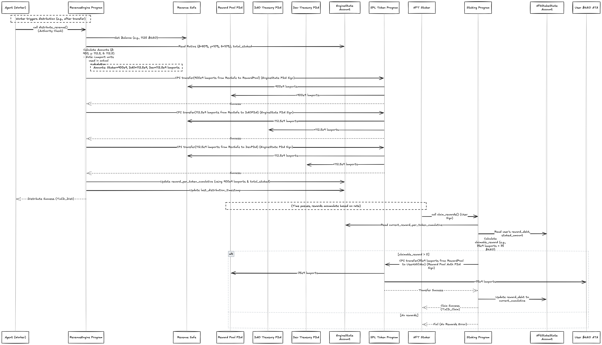

# HAiO - Revenue Engine & Agent Autonomy (Solana Seoulana Hackathon 제출작)

[](https://opensource.org/licenses/MIT)

**HAiO는 AI Agent와 Solana 블록체인의 투명한 Web3 원칙으로 구동되는 음악 창작 및 수익 창출의 미래를 구축하고 있습니다.** 이 저장소는 Solana Seoulana Hackathon을 위해 개발된 **Revenue Engine**의 핵심 구현과 HAiO Agent의 **자율적 경제 활동**을 보여줍니다.

## 🚀 비전: 지속 가능하고 자율적인 음악 생태계

AI 음악 생성의 부상은 놀라운 기회를 제공하지만 새로운 과제도 함께 제시합니다: AI 운영 비용을 어떻게 관리할까요? AI가 창출한 가치를 어떻게 공정하게 분배할까요? 성장하고 적응할 수 있는 시스템을 어떻게 구축할까요?

HAiO는 다음과 같은 **Web3 네이티브 인프라**를 구축하여 이러한 과제들을 정면으로 해결합니다:

1. **AI Agent가 자율적으로 행동합니다:** 우리의 Agent는 단순히 창작하는 것을 넘어 경제에 참여합니다. 그들은 운영 비용(ATH 토큰을 통한 GPU 사용량 등)을 관리하고, DEX에서 자산을 교환하며(모의 구현), 토큰 가치에 적극적으로 기여합니다($HAiO 소각).

2. **가치 분배는 투명하고 자동화됩니다:** Solana 스마트 컨트랙트로 구축된 **Revenue Engine**은 Agent가 생성한 모든 순수익($HAiO)이 명확한 온체인 규칙에 따라 생태계 참여자(NFT Staker, DAO, 개발자)에게 분배되도록 보장합니다.

3. **생태계는 지속 가능하고 확장 가능합니다:** 핵심 엔진은 **Hub**로 설계되어 다양한 미래 모듈(라이센싱, 데이터 보상, 라이브 Agent 기능, 제3자 Agent)이 원활하게 연결될 수 있어, 지속적으로 진화하고 풍부해지는 플랫폼을 만듭니다.

## 💡 작동 방식: 핵심 메커니즘

이 해커톤 프로젝트는 핵심 경제 루프를 시연하는 데 중점을 둡니다:

1. **수익 유입:** 외부 수익(USDC로 시뮬레이션, 잠재적으로 SOL 또는 기타)이 Agent의 전용 `Agent Wallet`에 도착합니다.

2. **Agent 자율성(오프체인 Worker + 온체인 상호작용):**
   * 오프체인 **Agent(Worker)**가 `Agent Wallet`을 모니터링합니다.
   * **예산 할당 & 운영 비용:** Agent는 운영 비용에 사용할 자금을 계산하고 활용합니다. 예를 들어, 들어오는 USDC의 일부를 Mock ATH로 교환(`Mock Swap Program` 사용)하여 시뮬레이션된 GPU 리소스 비용을 지불하기 위해 지정된 Aethir 지갑으로 전송합니다. 이는 운영의 연속성과 유연성을 보장하기 위해 **먼저 오프체인에서** 발생합니다.
   * **가치 축적 & 표준화:** Agent는 *남은* USDC를 `Mock Swap Program`을 사용하여 네이티브 `$HAiO` 토큰으로 교환합니다.
   * **디플레이션 메커니즘:** 교환된 `$HAiO`의 일부는 SPL Token Program 명령을 통해 자동으로 **소각**되어 희소성을 증가시킵니다.
   * **수익 이전:** 최종 순 `$HAiO` 수익은 온체인 `Revenue Safe`로 이전됩니다(SPL 이전).

3. **투명한 분배(온체인 프로그램):**
   * **`RevenueEngine` Program**이 트리거됩니다(데모에서는 수동, 자동화 가능).
   * `Revenue Safe`의 `$HAiO` 잔액과 `EngineState Account`에 저장된 분배 비율(Staker를 위한 β%, DAO를 위한 γ%, 개발자를 위한 δ%)을 읽습니다.
   * 분배 금액을 계산하고 **CPI(Cross-Program Invocation)를 통해 `$HAiO`를 이전**하여 각각의 PDA: `Reward Pool PDA`, `DAO Treasury PDA`, `Developer Treasury PDA`로 보냅니다. `Revenue Safe`의 권한자(`EngineState` PDA)가 이러한 이전에 서명합니다.
   * 스테이킹 보상을 위해 `EngineState Account`의 전역 `reward_per_token_cumulative`를 업데이트합니다(지연 계산).

4. **사용자 보상(온체인 스테이킹):**
   * 사용자는 **`Staking Program`**을 사용하여 **Agent NFT**를 스테이킹합니다.
   * `Staking Program`은 개별 스테이크(`NftStakeState Account`)를 추적하고 `RevenueEngine`(CPI 통해)과 상호 작용하여 총 스테이킹 금액을 업데이트합니다.
   * 사용자는 언제든지 누적된 보상을 **청구**할 수 있습니다. `Staking Program`은 전역 `reward_per_token_cumulative`와 사용자의 `reward_debt`(지연 계산)를 기반으로 청구 가능한 금액을 계산하고 `Reward Pool PDA`에서 $HAiO를 사용자에게 이전합니다(자체 권한 PDA로 서명).

### 고수준 아키텍처 다이어그램


*수익은 Agent Wallet로 유입됩니다. 오프체인 Agent Worker가 이를 처리하고(비용 지불, 교환, 소각) 순 $HAiO를 온체인 Revenue Engine으로 보냅니다. Engine은 온체인 규칙에 따라 참여자에게 투명하게 자금을 분배하고, 참여자는 스테이킹을 통해 시스템과 다시 상호작용합니다.*

## 🛠️ 사용된 기술 스택

### 블록체인
- **Solana (Devnet)**: 효율적인 Agent 활동과 보상 분배를 위한 높은 속도와 낮은 트랜잭션 수수료 활용.

### 스마트 컨트랙트
- **Rust**
- **Anchor Framework (v0.31.0)**: 빠른 개발, 보안 및 더 쉬운 클라이언트 사이드 통합을 위함.

### 오프체인 Agent (Worker)
- **Node.js + TypeScript**: 비동기 작업, 모니터링, Solana와의 상호작용을 위함.
- **@solana/web3.js**: 핵심 Solana 라이브러리.
- **@solana/spl-token**: SPL 토큰 상호작용(이전, 소각)을 위함.
- **@coral-xyz/anchor**: Anchor 프로그램과의 상호작용(명령 호출, 상태 가져오기)을 위함.

### 토큰
- **SPL Token Standard**: $HAiO, USDC, ATH 목업 및 Agent NFT용.

### 프론트엔드 데모 (선택사항)
- React, TypeScript, Solana Wallet Adapter.

## 🏗️ 프로젝트 구조

```
haio-seoulana/
├── programs/             # Solana 스마트 컨트랙트 (Anchor)
│   ├── revenue_engine/   # 핵심 분배 로직 & 상태
│   ├── staking_program/  # NFT 스테이킹 & 보상 청구 로직
│   └── mock_swap_program/ # 데모 스왑 기능 (USDC<>HAiO, USDC<>ATH)
├── app/                  # 오프체인 Agent (Worker) 구현
│   └── src/agent.ts      # 메인 Worker 로직
├── scripts/              # 초기화 및 헬퍼 스크립트
│   └── init.ts           # 계정 설정, 토큰 민팅, 프로그램 초기화
├── tests/                # 엔드투엔드 테스트
│   └── haio-seoulana.ts
├── keypairs/             # Devnet 테스트용 키페어 (Mints, Wallets)
├── target/               # 컴파일된 아티팩트 (IDLs, types) - 보통 Gitignore 처리
├── frontend/             # React 프론트엔드 데모 (선택사항)
├── Anchor.toml           # Anchor 설정
├── Cargo.toml            # Rust 워크스페이스 설정
└── package.json          # Node.js 의존성 & 스크립트
```

## 📚 기술 아키텍처 세부 사항

### A. 핵심 개념

#### Agent Wallet vs Revenue Safe:
- **Agent Wallet (운영 지갑)**: 오프체인 Agent가 세계와 상호작용하기 위한 주요 인터페이스입니다. 다양한 수익 흐름(USDC, SOL 등)을 받고 개인 키를 보유하며, 운영 비용 지불(예: GPU 시간을 위한 ATH 전송), DEX/목업을 통한 자산 교환, 디플레이션 소각과 같은 유연하고 즉각적인 작업을 가능하게 합니다. 주요 목적은 운영 효율성과 자율성입니다. 처리 후에는 표준화된 순수익($HAiO)만 Revenue Safe로 전달합니다.
- **Revenue Safe**: 핵심 분배 시스템으로의 순수익 유입을 위한 단일하고 검증 가능한 진입점 역할을 하는 온체인 SPL 토큰 계정입니다. 하나 이상의 Agent Wallet에서 받은 $HAiO를 보유합니다. 그 잔액은 최종 분배 단계에서 투명성과 예측 가능성을 보장하는 RevenueEngine의 분배 계산 기준이 됩니다. 그 권한은 EngineState PDA로 설정되어 있어 오직 RevenueEngine 프로그램만이 분배 중에 이로부터 자금을 이동시킬 수 있습니다.

#### RevenueEngine Program:
- HAiO 생태계 전반의 경제 정책을 위한 온체인 규칙집이자 실행자입니다.
- 분배 비율(β, γ, δ), 총 스테이킹 금액, 누적 보상률과 같은 중요 매개변수를 저장하는 전역 EngineState Account를 관리합니다.
- distribute_revenue 함수가 핵심입니다: Revenue Safe 잔액을 읽고, EngineState의 비율에 기반하여 몫을 계산하고, 지정된 PDA 계정(Reward Pool PDA, DAO Treasury PDA, Developer Treasury PDA)으로 CPI를 통해 원자적 SPL 토큰 이전을 실행합니다. EngineState PDA가 Revenue Safe에서 나가는 이전에 서명합니다.
- Staking Program이 전역 total_staked_amount를 안정적으로 업데이트할 수 있도록 CPI 엔드포인트(increase/decrease_total_staked)를 제공하여 보상 계산의 정확성을 보장합니다.

#### Staking Program & 지연 계산:
- NFT 스테이킹 및 보상 청구와 관련된 사용자 상호작용을 관리합니다.
- 확장성을 위해 지연 계산 패턴을 채택합니다:
  - RevenueEngine에 의해 보상이 분배될 때, 오직 전역 reward_per_token_cumulative만 업데이트됩니다. 이 단계에서는 스테이커별 계산이 발생하지 않습니다.
  - 사용자가 보상을 청구하거나(또는 스테이킹 해제) 할 때, Staking Program은 현재 전역 비율을 읽고 사용자의 마지막 기록 비율(NftStakeState Account에 저장된 reward_debt)과 비교합니다.
  - 이 차이에 스테이킹된 금액을 곱하면 그 정확한 순간에 사용자의 개별 누적 보상이 결정됩니다. 이 계산은 사용자별로 필요에 따라 발생하여 계산 부하를 분산하고, 수십만 명의 스테이커가 있더라도 트랜잭션 크기 제한을 피합니다.
  - 프로그램은 자체 PDA(Reward Pool Authority PDA)를 사용하여 Reward Pool PDA에서 사용자에게 나가는 보상 이전에 서명합니다.

#### 오프체인 Agent & 현실적인 접근법:
- 이상적인 Web3 비전이 최대한의 온체인 로직을 포함한다는 것을 인정합니다. 그러나 가변 비용 서비스(GPU, API)와의 상호작용, DEX 스왑 최적화, 또는 미묘한 운영 로직 구현과 같은 복잡하고 동적이며 외부와 대면하는 작업의 경우, 오프체인 Agent는 중요한 유연성과 개발 속도를 제공합니다.
- 우리가 선택한 아키텍처는 이를 균형있게 조화시킵니다:
  - **오프체인에서의 유연성**: Agent가 운영 복잡성을 처리합니다.
  - **온체인에서의 투명성**: 최종 순수익 정산과 그 분배는 RevenueEngine과 Staking Program에 의해 시행되는 엄격하고 검증 가능한 온체인 규칙을 따릅니다.
  - **미래 향상**: 오프체인 행동에 대한 온체인 증명(예: 지출 로그의 해시 게시)을 구현하고 잠재적으로 고도로 표준화된 중요 예산 구성 요소(고정 요율 GPU 비용과 같은)를 나중에 PDA 기반 관리로 마이그레이션하여 투명성을 향상시킬 계획입니다.

### B. 중요 온체인 계정

#### EngineState Account (PDA):
- **목적**: RevenueEngine을 위한 전역 구성 및 실시간 경제 상태를 저장합니다. 여기에는 분배 비율(β, γ, δ), Revenue Safe 및 목적지 PDA의 주소, 현재 total_staked_amount, 그리고 지연 보상 계산을 위한 중요한 reward_per_token_cumulative가 포함됩니다.
- **시드**: ["engine_state_v1"] (엔진을 위한 단일 전역 상태를 보장합니다).
- **소유자**: RevenueEngine Program.
- **일반적인 권한자(업데이트용)**: 처음에는 Admin/Deployer 지갑으로 설정되며, 나중에 DAO로 이전될 예정입니다.

#### NftStakeState Account (PDA):
- **목적**: 특정 사용자가 스테이킹한 특정 NFT에 대한 스테이킹 세부 정보를 추적합니다. 사용자의 지갑, NFT 민트 주소, 스테이킹된 금액(현재 1), reward_debt(마지막 상호작용 시점의 전역 누적 비율), 스테이킹 타임스탬프, 그리고 그것이 속한 EngineState에 대한 참조를 저장합니다.
- **시드**: ["nft_stake", user_wallet_pubkey, nft_mint_pubkey] (사용자별 NFT별로 고유).
- **소유자**: Staking Program.

#### Revenue Safe Account (SPL Token Account):
- **목적**: Agent Wallet에서 수신한 순 $HAiO 수익을 RevenueEngine에 의한 분배를 기다리는 중앙 보유 계정입니다.
- **민트**: $HAiO.
- **권한자(이전을 위한)**: EngineState PDA. 이것은 중요합니다 – 오직 RevenueEngine 프로그램만이 PDA를 통해 분배 중에 안전에서 자금을 이동시킬 수 있습니다.

#### Reward Pool PDA Account (SPL Token Account):
- **목적**: Revenue Safe에서 분배 후 NFT 스테이커 보상(β%)을 위해 할당된 누적 $HAiO를 보유합니다.
- **민트**: $HAiO.
- **권한자(이전을 위한)**: Staking Program의 Reward Pool Authority PDA(["reward_pool_authority_seed"]에서 파생됨). 이는 오직 Staking Program만이 사용자의 유효한 청구를 처리할 때 이 풀에서 자금을 인출할 수 있도록 보장합니다.

#### DAO Treasury PDA Account (SPL Token Account):
- **목적**: 분배 후 DAO 운영(γ%)을 위해 할당된 누적 $HAiO를 보유합니다.
- **민트**: $HAiO.
- **권한자**: 일반적으로 DAO가 제어하는 멀티시그 지갑이나 거버넌스 프로그램 PDA입니다. RevenueEngine은 자체 PDA 서명을 통해 암시적으로 이 계정으로 이전할 권한만 필요합니다.

#### Developer Treasury PDA Account (SPL Token Account):
- **목적**: 분배 후 개발자 인센티브/보상(δ%)을 위해 할당된 누적 $HAiO를 보유합니다.
- **민트**: $HAiO.
- **권한자**: 개발자의 지갑, 플랫폼 멀티시그, 또는 다른 지정된 권한자입니다. DAO Treasury와 유사하게, RevenueEngine은 주로 여기로 이전합니다.

### C. 시퀀스 다이어그램

#### Agent 자율 처리


*이 다이어그램은 오프체인 Agent Worker가 Agent Wallet을 모니터링하고, 들어오는 USDC를 감지하고, 모의 스왑(USDC->ATH, USDC->$HAiO)을 수행하고, 외부 비용(ATH 전송)을 지불하고, $HAiO의 일부를 소각하고, 마지막으로 순 $HAiO 수익을 온체인 Revenue Safe로 이전하는 것을 보여줍니다. 이는 Agent가 메인 분배 엔진에 도달하기 전에 수익을 사전 처리하는 자율성을 강조합니다.*

#### 온체인 분배 & 청구


*이 다이어그램은 온체인 프로세스를 상세히 보여줍니다. RevenueEngine의 distribute_revenue 함수가 호출될 때 시작됩니다. 이는 Engine이 Revenue Safe를 읽고, 몫을 계산하고, SPL Token Program을 사용하여 CPI를 통해 Reward Pool과 Treasury PDA로 자금을 이전하고, 전역 EngineState를 업데이트하는 것을 보여줍니다. 그런 다음 사용자가 보상을 청구하는 것을 보여줍니다. 여기서 Staking Program은 EngineState를 읽고, 개별 보상을 계산하고, SPL Token Program을 통해 CPI 이전을 시작하여 Reward Pool에서 사용자의 지갑으로 이전합니다.*

### D. 확장 시나리오

이 RevenueEngine을 중심으로 한 Hub-and-Spoke 모델은 핵심 분배 메커니즘의 무결성이나 투명성(최종 분배 단계)을 훼손하지 않고 다양한 기능을 추가할 수 있는 명확하고 강력한 기초를 제공합니다.

#### 기술적 연결 지점:
- **수익 유입 모듈** (예: 라이센싱, 라이브 Agent 팁, 제3자 Agent 수수료): 이러한 모듈은 다양한 형태(USDC, SOL, $HAiO)로 수익을 생성합니다. 이 수익은 궁극적으로 관련 Agent Wallet로 유도되어야 합니다. 이 수익이 표준 Agent 처리 파이프라인(Revenue Safe로의 교환/소각/이전)에 들어가기 전에 변환/통합하기 위해 오프체인 프로세스(또는 간단한 경우 온체인 프로그램)가 필요할 수 있습니다. 제3자 Agent는 중앙 Revenue Safe나 운영 자금으로 흐를 수 있는 지정된 HAiO 플랫폼 지갑에 플랫폼 수수료(예: $HAiO)만 보낼 수 있습니다.
- **예산/보상 유출 모듈** (예: 데이터/RSI 보상, 라이브 Agent 상호작용 보상, 소셜 Agent 예산): 이러한 기능은 RevenueEngine의 출력으로 자금을 지원받습니다. distribute_revenue가 실행되면, γ%(DAO/Operations) 또는 다른 특별히 할당된 자금이 전용 Treasury/Pool PDA로 이전됩니다. 이러한 특정 모듈의 로직(예: DataRewardLogic, SocialAgentLogic)은 이후 이러한 PDA와 상호작용하여 오프체인 이벤트나 사용자 작업에 의해 자주 트리거되는 자체 규칙에 따라 자금을 지출합니다. 그들은 Revenue Safe와 직접 상호작용하지 않고 그 분배의 결과를 소비합니다.
- **Staking Program**: 입력(RevenueEngine에 CPI를 통해 total_staked_amount 업데이트)과 출력 소비자(EngineState에서 reward_per_token_cumulative 읽기 및 Reward Pool PDA에서 인출) 모두로 작용합니다.

## 🔮 미래 로드맵 & 비전

- **메인넷 출시 준비**: 보안 감사(스마트 컨트랙트 & Worker 로직), Testnet에서의 포괄적인 테스트, 개선된 키 관리 전략.
- **실제 DEX 통합**: Mock Swap Program을 선도적인 Solana DEX(예: Orca, Raydium, Jupiter)와의 통합으로 대체하여 슬리피지 제어 및 가격 가져오기를 포함한 실제 스왑 구현.
- **점진적 탈중앙화**: 분배 비율 및 주요 매개변수 업데이트를 위한 온체인 거버넌스(예: Realms) 구현. EngineState 권한을 점진적으로 DAO로 이전.
- **확장 모듈 확대**: 모듈식 라이센싱, ADI/RSI 보상, 라이브 Agent 기능과 같은 주요 확장 시나리오를 순차적으로 구현 및 통합.
- **SDK & 개발자 프로그램**: 제3자 개발자를 쉽게 온보딩하기 위한 SDK 및 잠재적으로 표준화된 Agent 템플릿 출시.

## 🙏 감사의 말

- 강력한 블록체인 및 개발 프레임워크를 제공한 Solana & Anchor 커뮤니티에 감사드립니다.

## 📄 라이센스

이 프로젝트는 MIT 라이센스 하에 제공됩니다.
