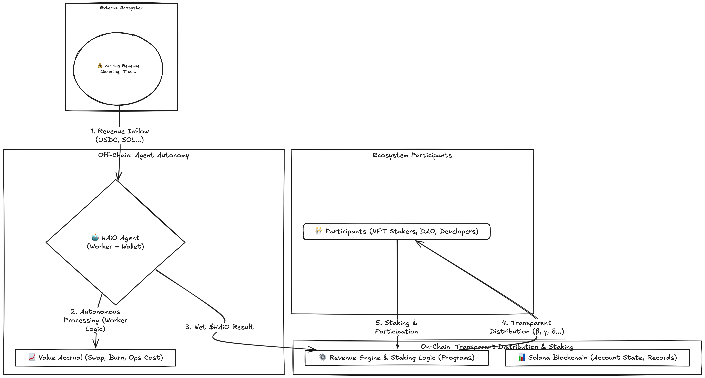
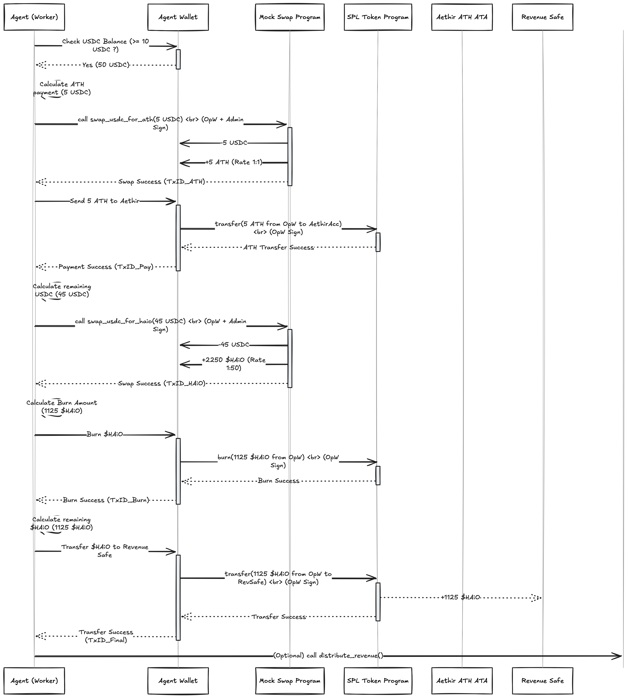

<p align="center">
  <a href="https://haio.fun" target="_blank">
    
  </a>
</p>

<h1 align="center">HAiO - Revenue Engine과 Agent 자율성</h1>

<p align="center">
  <strong>Solana 블록체인 상에서 AI 음악 창작과 수익화의 미래를 구축합니다.</strong>
  <br />
  (Seoulana 해커톤 제출작)
</p>

<p align="center">
  <a href="https://haio.fun" target="_blank">웹사이트</a> |
  <a href="https://haio-official.gitbook.io/haio" target="_blank">백서</a> |
  <a href="https://x.com/HAiO_Official" target="_blank">X (트위터)</a> |
  <a href="https://t.me/haio_official" target="_blank">텔레그램</a> |
  <a href="https://medium.com/@HAiO_Official" target="_blank">미디엄</a> |
  <a href="LICENSE">라이센스: MIT</a>
</p>

---

**HAiO는 AI `Agent`가 단순히 음악을 만드는 것을 넘어 Solana 위에 구축된 투명하고 Web3 네이티브 경제에 자율적으로 참여할 수 있게 합니다.** 이 저장소는 Solana Seoulana 해커톤을 위해 개발된 핵심 **`RevenueEngine`** 구현과 HAiO `Agent`의 **자율 경제 활동**을 보여줍니다.

## 🚀 비전: 지속 가능하고 자율적인 음악 생태계

AI 음악 생성의 부상은 놀라운 기회와 함께 새로운 도전과제를 제시합니다: AI 운영 비용을 어떻게 관리할까요? AI가 창출한 가치를 어떻게 공정하게 분배할까요? 성장하고 적응할 수 있는 시스템을 어떻게 구축할까요?

HAiO는 다음과 같은 **Web3 네이티브 인프라**를 구축하여 이러한 도전에 정면으로 대응합니다:

1. **AI `Agent`가 자율적으로 행동합니다:** 우리의 `Agent`는 단순히 창작하는 것을 넘어, 경제에 참여합니다. 운영 비용(이 데모에서는 ATH 토큰을 통해 GPU 사용 **시뮬레이션**)을 관리하고, 자산을 스왑하며(이 데모에서는 mock 프로그램 사용), 토큰 가치에 기여합니다($HAiO 소각). 이들은 능동적인 경제 참여자입니다.

2. **가치 분배가 투명하고 자동화되어 있습니다:** Solana 스마트 컨트랙트로 구축된 온체인 **`RevenueEngine`**은 `Agent`가 생성한 모든 순수익($HAiO)이 명확하고 검증 가능한 규칙에 따라 생태계 참여자(`Agent NFT` 스테이커, DAO, 개발자)에게 분배되도록 합니다.

3. **생태계는 지속 가능하고 확장 가능합니다:** 핵심 `RevenueEngine`은 **허브**로 설계되어 다양한 미래 모듈(라이센싱, 데이터 보상, Live `Agent` 기능, 제3자 `Agent`)이 원활하게 연결될 수 있어, 끊임없이 진화하고 풍부해지는 플랫폼을 만듭니다.

## 💡 작동 방식: 핵심 메커니즘 (해커톤 데모)

이 해커톤 프로젝트는 핵심 경제 순환 고리를 보여주는 데 중점을 둡니다:

1. **수익 유입:** 외부 수익(USDC로 시뮬레이션)이 `Agent`의 전용 `Agent Wallet`에 도착합니다.

2. **`Agent` 자율성 (오프체인 워커 + 온체인 상호작용):**
   * 오프체인 **`Agent`**가 자신의 `Agent Wallet`을 모니터링합니다.
   * **운영 비용 시뮬레이션:** `mock_swap_program`을 사용하여 유입되는 USDC의 일부를 Mock ATH로 스왑하고 지정된 Aethir 지갑으로 전송합니다(**GPU 리소스 지불 시뮬레이션**).
   * **가치를 축적하고 표준화합니다:** *남은* USDC를 `mock_swap_program`을 사용하여 네이티브 `$HAiO` 토큰으로 스왑합니다.
   * **토큰 소각:** SPL Token Program 명령을 통해 스왑된 `$HAiO`의 일부를 자동으로 소각합니다.
   * **순수익 전송:** 최종 순 `$HAiO` 수익을 온체인 `Revenue Safe`로 전송합니다.

3. **투명한 분배 (온체인 프로그램):**
   * **`RevenueEngine` Program**이 트리거됩니다.
   * `Revenue Safe`의 `$HAiO` 잔액과 `EngineState Account`에서 분배 비율(스테이커 β%, DAO γ%, 개발자 δ%)을 읽습니다.
   * 몫을 계산하고 `EngineState Account` PDA가 서명한 **`$HAiO`를 CPI를 통해** `Reward Pool PDA`, `DAO Treasury PDA`, `Developer Treasury PDA`로 **전송**합니다.
   * `EngineState Account`에서 글로벌 보상 비율(`reward_per_token_cumulative`)을 업데이트합니다(Lazy Calculation).

4. **사용자 보상 (온체인 스테이킹):**
   * 사용자는 **`staking_program`**을 사용하여 **`Agent NFT`**를 스테이킹합니다.
   * 사용자는 누적된 `$HAiO` 보상을 **청구**합니다. `staking_program`은 보상을 계산하고 `Reward Pool PDA`에서 토큰을 전송합니다.

### 고수준 아키텍처 다이어그램



*수익은 Agent Wallet로 유입됩니다. 오프체인 Agent는 이를 처리하고(비용 지불 시뮬레이션, 스왑, 소각), 순 $HAiO를 온체인 RevenueEngine으로 전송합니다. Engine은 온체인 규칙에 따라 참여자(스테이커, DAO, 개발자)에게 투명하게 자금을 분배하며, 참여자들은 스테이킹을 통해 다시 참여합니다.*

## 🛠️ 사용된 기술 스택

* **Blockchain:** Solana (Devnet)
* **Smart Contracts:** Rust, Anchor Framework (v0.31.0)
* **Off-Chain `Agent`:** Node.js, TypeScript, @solana/web3.js, @solana/spl-token, @coral-xyz/anchor
* **Tokens:** SPL Token Standard ($HAiO, USDC, ATH mocks, Agent NFT)
* **Frontend Demo:** React, TypeScript, Solana Wallet Adapter

## 🏗️ 프로젝트 구조 (주요 구성 요소)

```
HAiO-Seoulana/
├── programs/                # Solana 스마트 컨트랙트 (Anchor)
│   ├── revenue_engine/      # 핵심 분배 로직 & EngineState Account
│   ├── staking_program/     # NFT 스테이킹 & 보상 청구 로직 (NftStakeState)
│   └── mock_swap_program/   # 데모 스왑 기능
├── app/                     # 오프체인 Agent 구현
│   └── src/
│       ├── agent.ts         # 주요 자율 로직
│       ├── server.ts        # 데모용 API 서버
│       └── db.ts            # 로컬 로깅/상태 DB
├── scripts/                 # 초기화 스크립트
│   ├── prepare-keypairs.sh  # keypair 생성
│   └── init.ts              # 온체인 상태 & .env 파일 초기화
├── keypairs/                # 생성된 keypair (안전하게 보관!)
├── frontend/                # 데모용 React 프론트엔드
└── ...                      # 설정 파일
```

## ⚙️ 설정 & 테스트

### 전제 조건
- Node.js (v20+)
- Rust와 Cargo
- Solana CLI 도구
- Anchor Framework

### 시작하기 (FOR LOCAL / Using solana-test-validator)
1. **복제 & 설치:**
   ```
   git clone https://github.com/cto-haio/HAiO-Seoulana.git
   cd HAiO-Seoulana
   yarn install
   ```

2. **Keypair 준비:**
   ```
   bash scripts/prepare-keypairs.sh
   ```

3. **빌드, 배포, 초기화:**
   - 로컬 검증자 시작: `solana-test-validator`
   - Solana CLI 타겟 네트워크 설정: `solana config set --url localhost`
   - Anchor provider 클러스터 설정: Anchor.toml -> [provider] -> cluster = "localnet" 수정
   - `solana config set -k keypairs/id.json`
   - `solana airdrop 100`
   - `yarn run build`

4. **Agent API 시작:**
   ```
   cd app
   yarn install
   yarn dev:server
   ```

5. **프론트엔드 시작:**
   ```
   cd frontend
   # .env에 REACT_APP_RPC_URL이 올바르게 설정되어 있는지 확인
   yarn install
   yarn start
   ```

### 테스트
- 프론트엔드 데모 사용 (http://localhost:3000)

## 📝 구현 참고사항

### 데모 vs 프로덕션 아키텍처

해커톤 데모를 위해 일부 측면을 단순화했습니다:

- **Agent 실행 모델:**
  - 데모: API 호출을 통해 트리거됨.
  - 프로덕션: 연속적인 데몬 프로세스.

- **mock_swap_program:**
  - 데모: 단순화된 목업 스왑.
  - 프로덕션: 실제 DEX와 통합 (Jupiter, Orca, Raydium).

- **Treasury:**
  - 데모: 로컬 keypair 권한을 가진 단순 SPL Token 계정.
  - 프로덕션: 다중 서명 또는 거버넌스 제어 treasury.

- **네트워크:**
  - 데모: 로컬 검증자 또는 Devnet에서 작동.
  - 프로덕션: 향상된 보안으로 Mainnet 배포.

- **키 관리:**
  - 데모: 로컬 .json 파일.
  - 프로덕션: 안전한 키 관리 솔루션 (Vaults, HSM, MPC).

## 🔮 미래 로드맵 & 비전

1. **Mainnet 출시 준비:** 보안 감사(스마트 컨트랙트 & Agent 로직), 포괄적인 Testnet 테스트, 개선된 키 관리 전략.

2. **실제 DEX 통합:** 최적의 스왑을 위해 mock_swap_program을 강력한 DEX 통합(예: Jupiter API)으로 대체.

3. **점진적 탈중앙화:** 분배 비율 업데이트 및 EngineState Account 권한을 DAO로 이전하기 위한 온체인 거버넌스(예: Realms) 구현.

4. **확장 모듈 확대:** 모듈식 라이센싱, ADI/RSI 보상, Live Agent 기능, 3rd Party Agent 지원을 순차적으로 구현 및 통합.

5. **SDK & 개발자 프로그램:** 제3자 개발을 용이하게 하기 위한 SDK 및 표준화된 Agent 템플릿 출시.

## 🙏 감사의 말

- 강력한 블록체인 및 개발 프레임워크를 제공한 Solana & Anchor 커뮤니티.
- 이 프로젝트를 선보일 기회를 준 Solana Seoulana 해커톤.

## 📄 라이센스

MIT 라이센스. 자세한 내용은 [LICENSE](LICENSE) 파일을 참조하세요.

## 부록: 기술 아키텍처 세부사항

### A. 핵심 개념

#### Agent Wallet vs Revenue Safe:
- **Agent Wallet:** 오프체인 Agent의 운영 계정으로, 개인 키를 보유합니다. 다양한 초기 수익 스트림(USDC 등)을 받아 운영 비용 지불(ATH 전송을 통한 시뮬레이션), mock_swap_program을 통한 자산 스왑, 소각 실행과 같은 유연한 작업을 가능하게 합니다. 목표는 운영 효율성과 자율성입니다. 처리 후에는 순 $HAiO 수익만 Revenue Safe로 전달합니다.
- **Revenue Safe:** 온체인 SPL 토큰 계정으로, 분배 시스템으로의 순 $HAiO 수익의 단일하고 검증 가능한 진입점입니다. 그 잔액이 RevenueEngine을 트리거합니다. 권한은 EngineState Account PDA로, RevenueEngine 프로그램만이 자금 유출을 제어하도록 보장합니다.

#### RevenueEngine Program:
- HAiO 경제 정책을 위한 온체인 규칙집입니다.
- 글로벌 EngineState Account(비율 β, γ, δ, 총 스테이킹 양, 누적 보상 비율 저장)를 관리합니다.
- distribute_revenue 함수는 Revenue Safe를 읽고, 몫을 계산하고, EngineState Account PDA가 서명한 CPI를 통해 Reward Pool PDA, DAO Treasury PDA, Developer Treasury PDA로 원자적 SPL Token 전송을 실행합니다.
- staking_program이 총 스테이킹 양을 업데이트할 수 있는 CPI 엔드포인트를 제공합니다.

#### staking_program & Lazy Calculation:
- NFT 스테이킹 및 보상 청구를 관리합니다.
- 확장성을 위해 Lazy Calculation을 사용합니다: RevenueEngine은 글로벌 비율만 업데이트합니다. staking_program은 사용자가 청구하거나 언스테이크할 때만 개별 보상을 계산하며, 현재 글로벌 비율과 사용자의 마지막 기록 비율(NftStakeState Account의 reward_debt)을 비교합니다. 이는 로드를 효율적으로 분산시킵니다. 프로그램은 자체 파생 authority PDA를 사용하여 Reward Pool PDA에서 보상 전송에 서명합니다.

#### 오프체인 Agent & 현실적 접근:
- 온체인 투명성을 목표로 하지만, 복잡하고 동적인 작업(비용 지불, DEX 상호작용 등)은 개발 속도와 운영 현실을 위해 유연한 오프체인 Agent가 처리합니다.
- 아키텍처는 균형을 맞춥니다: Agent는 오프체인에서 복잡성을 처리하고, 최종 순수익 정산 및 분배는 엄격하고 검증 가능한 온체인 규칙을 따릅니다.
- 미래 계획에는 투명성 강화(예: 오프체인 작업의 온체인 증명)가 포함됩니다.

### B. 중요한 온체인 계정

#### EngineState Account (PDA):
- **목적:** RevenueEngine을 위한 글로벌 구성 및 실시간 경제 상태. 비율(β, γ, δ), 주소(Safe, Pool, Treasury), total_staked_amount, reward_per_token_cumulative를 저장합니다.
- **Seed:** ["engine_state_v1"]. **Owner:** RevenueEngine Program. **Authority (업데이트용):** 초기에는 Admin keypair.

#### NftStakeState Account (PDA):
- **목적:** 개별 NFT 스테이킹 세부정보(사용자, 민트, 금액, reward_debt, 타임스탬프, engine_state_ref)를 추적합니다.
- **Seed:** ["nft_stake", user_wallet_pubkey, nft_mint_pubkey]. **Owner:** staking_program.

#### Revenue Safe Account (SPL Token Account):
- **목적:** Agent Wallet에서 온 순 $HAiO 수익을 분배 대기 중에 보유합니다.
- **Mint:** $HAiO. **Authority:** EngineState Account PDA.

#### Reward Pool PDA Account (SPL Token Account):
- **목적:** 스테이커 보상(β%)을 위한 $HAiO를 보유합니다.
- **Mint:** $HAiO. **Authority:** staking_program의 Reward Pool Authority PDA (Seed: ["reward_pool_authority_seed"]).

#### DAO Treasury PDA Account (SPL Token Account):
- **목적:** DAO 운영을 위한 $HAiO를 보유합니다(γ%).
- **Mint:** $HAiO. **Authority:** DAO 또는 그 관리자를 나타내는 전용 keypair(revenue-engine-dao-treasury.json)에 의해 제어됩니다. (데모에서는 로컬 keypair 사용; 프로덕션에서는 DAO 다중서명/프로그램 사용).

#### Developer Treasury PDA Account (SPL Token Account):
- **목적:** 개발자 인센티브를 위한 $HAiO를 보유합니다(δ%).
- **Mint:** $HAiO. **Authority:** 개발자 엔티티 또는 펀드를 나타내는 전용 keypair(revenue-engine-developer-treasury.json)에 의해 제어됩니다. (데모에서는 로컬 keypair 사용; 프로덕션 설정은 다양).

### C. 시퀀스 다이어그램

#### Agent 자율 처리


*오프체인 Agent Worker가 Agent Wallet을 모니터링하고, 유입되는 USDC를 감지하여, 목업 스왑(USDC->ATH, USDC->$HAiO)을 수행하고, 외부 비용을 지불하고(ATH 전송), $HAiO를 소각하고, 순 $HAiO를 온체인 Revenue Safe로 전송하는 과정을 보여줍니다.*

#### 온체인 분배 & 청구


*온체인 프로세스 세부 사항: RevenueEngine이 Revenue Safe를 읽고, 몫을 계산하고, CPI를 통해 Reward Pool과 Treasury PDA로 자금을 전송하고, EngineState Account를 업데이트합니다. 그런 다음 사용자가 staking_program을 통해 보상을 청구하는 과정을 보여주며, 이 과정에서 EngineState Account를 읽고, 보상을 계산하고, Reward Pool PDA에서 CPI 전송을 시작합니다.*

### D. 확장 시나리오

RevenueEngine을 중심으로 하는 이 Hub-and-Spoke 모델은 핵심 분배 메커니즘의 무결성이나 투명성(최종 분배 단계의 경우)을 훼손하지 않고 다양한 기능을 추가할 수 있는 명확하고 강력한 기반을 제공합니다.

#### 기술 연결 지점:
- **수익 유입 모듈** (예: 라이센싱, Live Agent 팁, 3rd Party Agent 수수료): 이러한 모듈은 다양한 형태(USDC, SOL, $HAiO)로 수익을 생성합니다. 이 수익은 궁극적으로 관련 Agent Wallet로 향해야 합니다. 이 수익이 표준 Agent 처리 파이프라인(스왑/소각/Revenue Safe로 전송)에 들어가기 전에 변환/통합하기 위해 오프체인 프로세스(또는 간단한 경우 온체인 프로그램)가 필요할 수 있습니다. 3rd Party Agent는 지정된 HAiO 플랫폼 지갑에 플랫폼 수수료(예: $HAiO)만 보낼 수 있으며, 이는 중앙 Revenue Safe 또는 운영 자금으로 흐를 수 있습니다.

- **예산/보상 유출 모듈** (예: 데이터/RSI 보상, Live Agent 상호작용 보상, 소셜 Agent 예산): 이러한 기능은 RevenueEngine의 출력으로 자금이 조달됩니다. distribute_revenue가 실행되면 γ%(DAO/운영) 또는 기타 특별히 할당된 자금이 전용 Treasury/Pool PDA로 전송됩니다. 이러한 특정 모듈의 로직(예: DataRewardLogic, SocialAgentLogic)은 이러한 PDA와 상호작용하여 자체 규칙에 따라 자금을 지출하며, 종종 오프체인 이벤트나 사용자 액션에 의해 트리거됩니다. 이들은 Revenue Safe와 직접 상호작용하지 않고 그 분배 결과를 소비합니다.

- **staking_program**: 입력(RevenueEngine에 CPI를 통해 total_staked_amount 업데이트)과 출력 소비자(EngineState Account에서 reward_per_token_cumulative를 읽고 Reward Pool PDA에서 인출) 모두로 작용합니다.

### E. 배포된 Devnet 프로그램 및 주요 계정 정보

다음 표는 이 데모를 위해 Solana Devnet에 배포된 주요 프로그램 ID 및 계정 주소 목록입니다 (`init.ts` 마지막 실행 로그 기준). 링크를 클릭하여 Solscan에서 확인할 수 있습니다.

| 항목                      | 주소 (Address)                                 | Solscan 링크 (Devnet)                                                                                             | 설명                                             |
| :------------------------ | :--------------------------------------------- | :---------------------------------------------------------------------------------------------------------------- | :----------------------------------------------- |
| **Programs**              |                                                |                                                                                                                   |                                                  |
| `RevenueEngine` Program   | `AUdeJW2sdUErNTqyRvSYcYZJE72yURxLxQ9GeEVayLqq` | [Link](https://solscan.io/account/AUdeJW2sdUErNTqyRvSYcYZJE72yURxLxQ9GeEVayLqq?cluster=devnet#splTransfers)   | 핵심 온체인 분배 로직.                           |
| `staking_program`         | `DNEYpF5jMNjpxAPNYQhPkpuaxWGudBTvyrmKDkNQdZMP` | [Link](https://solscan.io/account/DNEYpF5jMNjpxAPNYQhPkpuaxWGudBTvyrmKDkNQdZMP?cluster=devnet#splTransfers)   | NFT 스테이킹 및 보상 청구 관리.                  |
| `mock_swap_program`       | `G9gP6qjaZcAyKaCzszcvABkd5UUorfnFe9PjnRkm7qKS` | [Link](https://solscan.io/account/G9gP6qjaZcAyKaCzszcvABkd5UUorfnFe9PjnRkm7qKS?cluster=devnet#splTransfers)   | USDC/$HAiO/ATH 간편 스왑 시뮬레이터.           |
| **Mints**                 |                                                |                                                                                                                   |                                                  |
| MockUSDC Mint             | `8im1vXoAGdu6pmhhEUX9nJM3VVJMjs78e8NXZ96TXBhd` | [Link](https://solscan.io/account/8im1vXoAGdu6pmhhEUX9nJM3VVJMjs78e8NXZ96TXBhd?cluster=devnet#splTransfers)   | Mock USDC 토큰 민트 주소.                       |
| Mock$HAiO Mint            | `3FJMrspw8QCyG9ZwZ4e1u9agwCn6epYGkuKhna6JPU6B` | [Link](https://solscan.io/account/3FJMrspw8QCyG9ZwZ4e1u9agwCn6epYGkuKhna6JPU6B?cluster=devnet#splTransfers)   | Mock $HAiO 토큰 민트 주소.                      |
| MockATH Mint              | `51nkSennLj28qLAyi4G53SRWqLVeatPS6Qt4F1KJSqWw` | [Link](https://solscan.io/account/51nkSennLj28qLAyi4G53SRWqLVeatPS6Qt4F1KJSqWw?cluster=devnet#splTransfers)   | Mock ATH 토큰 민트 주소.                        |
| Demo `Agent NFT` Mint     | `EeAoVVLFP6Anko1HXzZbNtRPDNUsuy2vA2uL8b5mitzw` | [Link](https://solscan.io/account/EeAoVVLFP6Anko1HXzZbNtRPDNUsuy2vA2uL8b5mitzw?cluster=devnet#splTransfers)   | 데모 Agent NFT 민트 주소.                       |
| **Key Accounts & PDAs** |                                                |                                                                                                                   |                                                  |
| `EngineState Account` PDA | `5sys4KfG88uWsBC9QyTiTYjjSZNKMUeN68hRGYYfDd3E` | [Link](https://solscan.io/account/5sys4KfG88uWsBC9QyTiTYjjSZNKMUeN68hRGYYfDd3E?cluster=devnet#splTransfers)   | RevenueEngine의 글로벌 상태 저장.                  |
| `Revenue Safe` ATA        | `BM74qUpQ9kEovDLabQYZHtEhm4vjZHbqLNfeLb58FuNj` | [Link](https://solscan.io/account/BM74qUpQ9kEovDLabQYZHtEhm4vjZHbqLNfeLb58FuNj?cluster=devnet#splTransfers)   | 분배 대기 중인 순수 $HAiO 보관.                 |
| `Reward Pool PDA` ATA     | `J6AvGuo591hfbjdEbTefrZtRkEGKfb8peZeMarTr8yLi` | [Link](https://solscan.io/account/J6AvGuo591hfbjdEbTefrZtRkEGKfb8peZeMarTr8yLi?cluster=devnet#splTransfers)   | 스테이커 보상용 $HAiO 보관.                     |
| `DAO Treasury` ATA        | `4r6EG2At59dQWAYUAA1UFEM5NA5TSei1bkCNSxDcmoqn` | [Link](https://solscan.io/account/4r6EG2At59dQWAYUAA1UFEM5NA5TSei1bkCNSxDcmoqn?cluster=devnet#splTransfers)   | 분배된 DAO 예산($HAiO) 보관.                 |
| `Developer Treasury` ATA  | `C4XsLAs4d9v4PVp5jTmcjH8uLQToDSdUa6wuMom5xrHr` | [Link](https://solscan.io/account/C4XsLAs4d9v4PVp5jTmcjH8uLQToDSdUa6wuMom5xrHr?cluster=devnet#splTransfers)   | 분배된 개발자 인센티브($HAiO) 보관.           |
| `Agent Wallet`            | `BNFAmQmu1PLGq2KUnZzrewhYTGUyeoVU1RCgpTgDyFYT` | [Link](https://solscan.io/account/BNFAmQmu1PLGq2KUnZzrewhYTGUyeoVU1RCgpTgDyFYT?cluster=devnet#splTransfers)   | 오프체인 Agent의 운영 지갑.                     |
| Mock Aethir Wallet        | `9xnuthx47YVPyYHCxs4oQRu8hHa67DJfotFsx7T5g6PR` | [Link](https://solscan.io/account/9xnuthx47YVPyYHCxs4oQRu8hHa67DJfotFsx7T5g6PR?cluster=devnet#splTransfers)   | 시뮬레이션된 ATH 비용 지불 대상 지갑.           |

*(참고: Solscan의 잔액은 마지막 상호작용 후의 상태를 반영합니다.)*